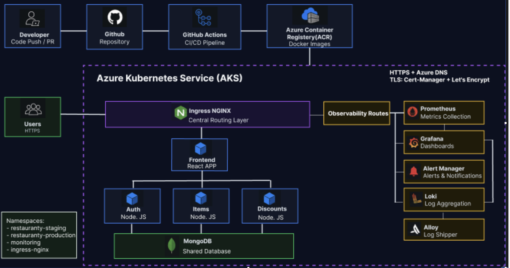
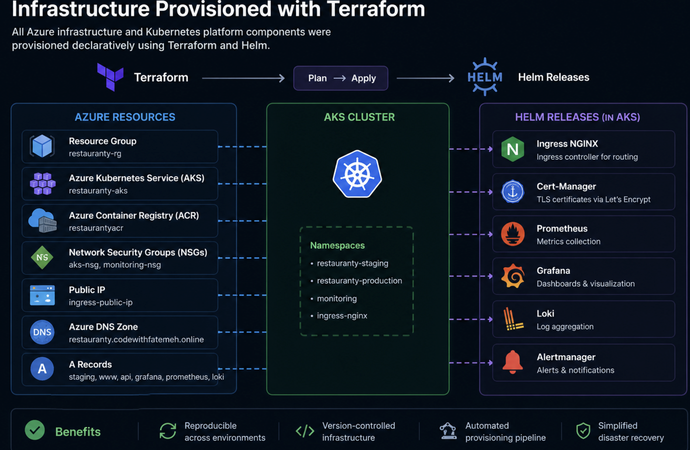
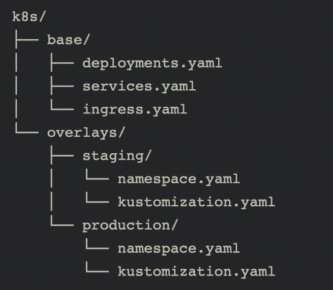
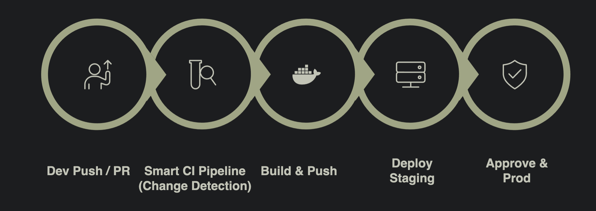

# Production-Grade DevOps Platform

Restauranty was transformed from a locally hosted microservices application into a production-grade cloud-native platform running on Azure Kubernetes Service (AKS).

The platform includes Infrastructure as Code with Terraform, multi-environment Kubernetes deployments, automated CI/CD pipelines, centralized observability, HTTPS automation, and production-oriented security practices.

---

# Final Architecture



The platform architecture consists of:

* Azure Kubernetes Service (AKS)
* Multi-service microservices deployment
* Ingress NGINX as centralized routing layer
* Azure Container Registry (ACR)
* GitHub Actions CI/CD
* Monitoring and logging stack
* HTTPS and TLS automation with Cert-Manager

---

# Infrastructure as Code (Terraform)



All Azure infrastructure is provisioned declaratively using Terraform.

Provisioned resources include:

* Azure Resource Group
* Azure Kubernetes Service (AKS)
* Azure Container Registry (ACR)
* Public IP resources
* Azure DNS Zone
* Network Security Groups (NSGs)
* DNS A Records

Benefits:

* Reproducible environments
* Version-controlled infrastructure
* Automated provisioning
* Simplified disaster recovery

---

# Kubernetes & AKS

The application was migrated from Docker Compose to Kubernetes to support production-grade orchestration and scalability.

Implemented Kubernetes features:

* Multi-namespace isolation
* Centralized ingress routing
* Self-healing deployments
* Kubernetes Services & Ingress
* Environment-specific deployments
* Declarative manifests

Namespaces:

* `restauranty-staging`
* `restauranty-production`
* `monitoring`
* `ingress-nginx`

---

# Multi-Environment Deployments



Kustomize overlays are used for environment-specific configuration management.

Structure:

* Shared base manifests
* Separate staging overlay
* Separate production overlay
* Environment-specific namespaces and ingress hosts

Benefits:

* Cleaner configuration management
* Safer release workflow
* Staging validation before production
* Environment isolation

---

# CI/CD Pipeline



GitHub Actions powers the automated CI/CD pipeline.

Pipeline stages:

1. Developer Push / Pull Request
2. Smart CI Pipeline (Change Detection)
3. Build & Push Docker Images
4. Automatic Staging Deployment
5. Manual Production Approval

CI/CD Features:

* Selective builds for changed services only
* Dynamic image tagging using Git SHA
* Pull Request validation
* Environment-aware deployments
* Post-deployment health checks
* Production approval gate

---

# Security & HTTPS

Security hardening was implemented across the platform.

Implemented controls:

## Network Security

* HTTPS enforcement
* TLS certificates via Cert-Manager
* Automatic certificate renewal
* HTTPS redirect at ingress layer

## Access & Secrets

* Kubernetes Secrets
* GitHub Secrets
* Least-privilege RBAC

## Infrastructure Security

* Private Azure Container Registry
* Kubernetes NetworkPolicies
* Restricted cluster access

TLS certificates are automatically issued and renewed using Let's Encrypt and Cert-Manager.

---

# Monitoring & Centralized Logging

Production-grade observability was implemented using the Prometheus ecosystem and Loki stack.

## Prometheus

* Kubernetes metrics collection
* Custom application metrics scraping
* MongoDB metrics
* ServiceMonitor integration

## Grafana

* Custom dashboards for:

  * HTTP traffic
  * CPU & memory
  * Pod health
  * Application metrics

## Loki + Alloy

* Centralized Kubernetes log aggregation
* Pod log collection and shipping

## Alertmanager

* Automated infrastructure alerts
* Database connectivity alerts
* Real-time monitoring notifications

Custom metrics were exposed directly from backend microservices and visualized through Grafana dashboards.

---

# Local Development vs Production Platform

Original local setup:

* Docker Compose
* HAProxy routing
* Single-host deployment
* Manual deployments
* No observability
* No environment isolation

Final production platform:

* Kubernetes on AKS
* GitHub Actions CI/CD
* Multi-environment deployments
* HTTPS & TLS automation
* Centralized monitoring & logging
* Infrastructure as Code
* Automated deployment workflows

---

# Tech Stack

## Cloud & Infrastructure

* Microsoft Azure
* Terraform
* Azure Kubernetes Service (AKS)
* Azure Container Registry (ACR)

## Kubernetes Ecosystem

* Kubernetes
* Kustomize
* Helm
* Ingress NGINX
* Cert-Manager

## CI/CD

* GitHub Actions
* Docker

## Monitoring & Logging

* Prometheus
* Grafana
* Loki
* Alloy
* Alertmanager

## Application Stack

* React
* Node.js / Express
* MongoDB

---

# Future Improvements

Potential future enhancements:

* Horizontal Pod Autoscaling (HPA)
* GitOps with ArgoCD
* Distributed tracing
* Advanced security scanning
* Private networking
* Blue/Green deployments

---

# Repository Structure

```text
terraform/      -> Azure infrastructure provisioning
k8s/            -> Kubernetes manifests & Kustomize overlays
.github/        -> GitHub Actions workflows
monitoring/     -> Observability configuration
scripts/        -> Deployment automation
```

---

# Outcome

Restauranty evolved from a local development project into a production-oriented cloud-native platform featuring:

* Automated infrastructure provisioning
* Kubernetes orchestration
* Production-grade CI/CD
* HTTPS automation
* Centralized observability
* Secure deployment workflows
* Multi-environment release management
